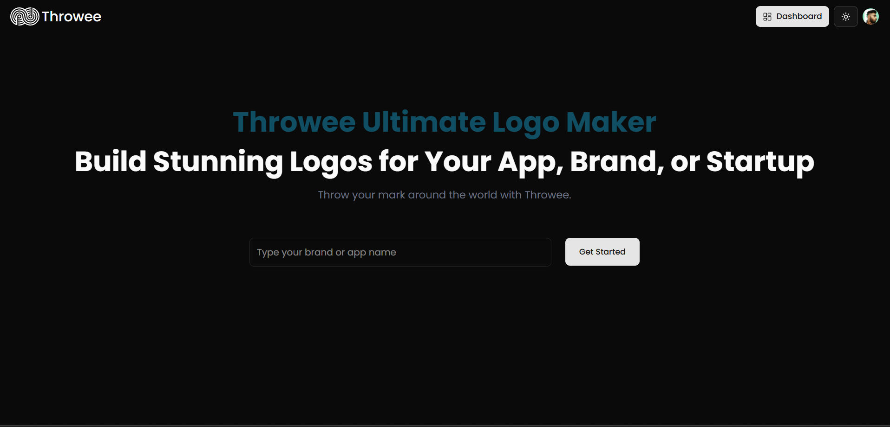
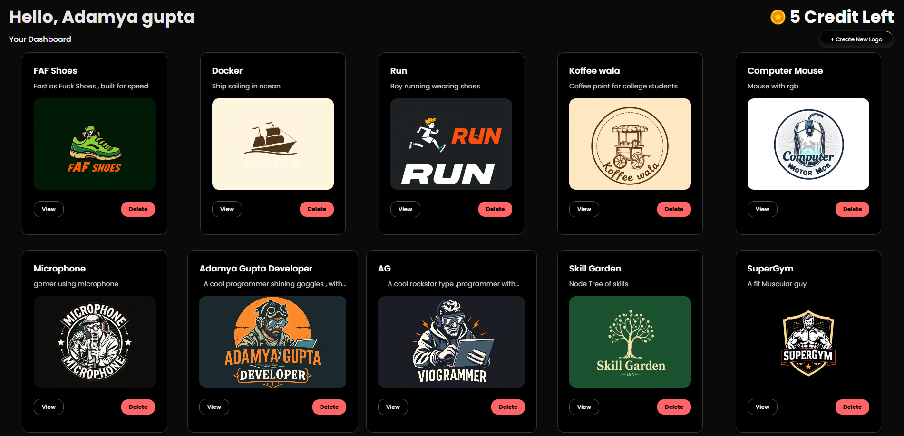

#  Throwee

[](https://github.com/Adamya-Gupta/Throwee/blob/main/LICENSE)

## 🔍 Overview:
Throwee is a logo generation tool that uses the Gemmini API and Flux models to create visually stunning logos based on user prompts. It supports multiple themes, auto-suggestions, and is available in both light and dark modes.

<div align="center">
<table width="1000" >
<tr>
<td align="center">
Landing Page

</td>
<td align="center">
Dashboard

</td>
</tr>
</table>
</div>

## 📌 Features
- 🎨 Choose from 9 different themes
- 🔄 Auto-generated prompt suggestions based on your description
- 💾 User-specific logo history (stored in user accounts)
- 🌗 Light and dark mode support
- 🔤 Accurate text rendering
- 🆓 Unfiltered input — name your project anything you want

## 🛠️ Tech Stack
- [Nextjs](https://nextjs.org/)
- [GemminiAPI](https://ai.google.dev/)
- [Hugging Face](https://huggingface.co/)
- [Magic UI](https://magicui.design/)
- [Aceternity UI](https://ui.aceternity.com/)
- [Firebase](https://firebase.google.com/)
- [Clerk](https://clerk.com/)

## ⚙️Installation & Setup

### Step 1: Clone the Repository

```bash
  # Clone the repository
  git clone https://github.com/Adamya-Gupta/Throwee.git
```

### Step 2: Install Required Dependencies

```bash
# Install dependencies
npm install
```

### Step 3: Environment Variables

To run this project, you will need to add the following environment variables to your .env file

```
NEXT_PUBLIC_CLERK_PUBLISHABLE_KEY= your_api_key
CLERK_SECRET_KEY= your_secret_key

NEXT_PUBLIC_FIREBASE_API_KEY= your_api_key
NEXT_PUBLIC_GEMINI_API_KEY= your_api_key

HUGGING_FACE_API_KEY= your_api_key
```

### Step 4: Run the development server:


First, run the development server:

```bash
npm run dev
# or
yarn dev
# or
pnpm dev
# or
bun dev
```

Open [http://localhost:3000](http://localhost:3000) with your browser to see the result.

You can start editing the page by modifying `app/page.js`. The page auto-updates as you edit the file.


## API Endpoints

| Route | Methods | File | Type |
|-------|---------|------|------|
| `\api\ai-design-ideas\route.jsx` | POST | `app\api\ai-design-ideas\route.jsx` | App Router |
| `\api\ai-logo-model\route.jsx` | POST | `app\api\ai-logo-model\route.jsx` | App Router |
| `\api\users\route.jsx` | POST | `app\api\users\route.jsx` | App Router |

>[!NOTE]
>API Documentation done using [@adamtools/apifinder](https://www.npmjs.com/package/@adamtools/apifinder) npm package.

## 📁 Project Structure

```
throwee
├── public  # Static assets  
├── app  # API routes, pages, and custom components       
├── components    # Library components (MagicUI, ShadCN, etc.)
├── lib   
├── middleware.js # clerk configurations  
├── .gitignore # Includes .env
└── .env    
```

## 🚀 Future Improvements
- 💳 Integrate payment gateway for premium access
- 💎 Add a premium model with enhanced design capabilities
- 🧩 Introduce more customizable UI/UX components
